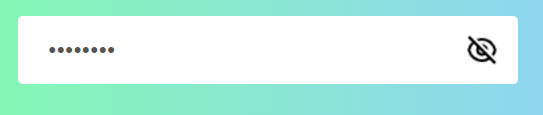

# Hide and Show Password

This project demonstrates how to implement a hide and show password feature using JavaScript.

## Technologies Used

- HTML
- CSS
- JavaScript

## Features

- Toggle visibility of password input field
- Simple and clean user interface

## How to Use

1. Clone the repository:
    ```bash
    git clone https://github.com/yourusername/your-repo.git
    ```
2. Navigate to the project directory:
    ```bash
    cd your-repo/project_10\ hide\ and\ show\ password
    ```
3. Open `index.html` in your web browser to see the feature in action.

## Project Structure

- `index.html` - The main HTML file.
- `styles.css` - The CSS file for styling.
- `script.js` - The JavaScript file containing the logic for toggling password visibility.

## License

This project is licensed under the MIT License.

## Contributing

Contributions are welcome! Please open an issue or submit a pull request for any changes.

## Contact

For any questions or feedback, please contact [your-email@example.com](mailto:your-email@example.com).