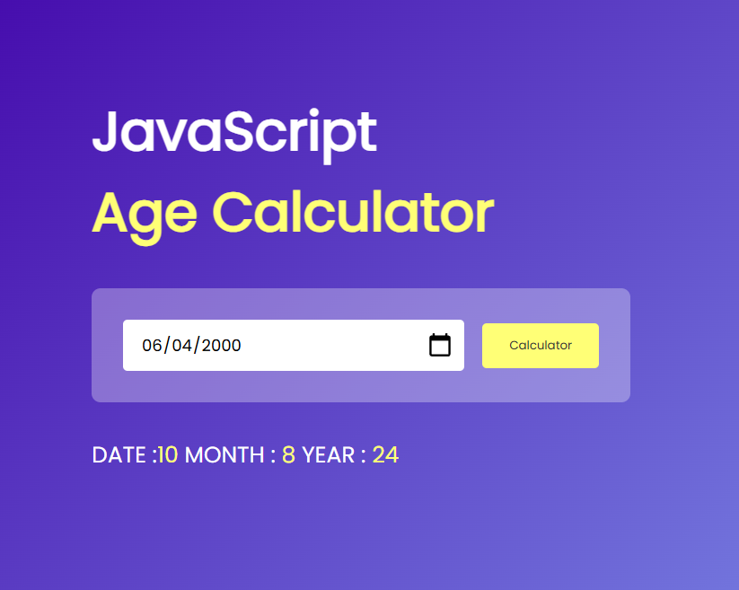

## Age Calculator

This project is a simple age calculator built using JavaScript. It allows users to input their birthdate and calculates their age based on the current date.

### Technologies Used

- HTML
- CSS
- JavaScript

### How to Use

1. Clone the repository to your local machine.
2. Open the `index.html` file in your web browser.
3. Enter your birthdate in the provided input field.
4. Click the "Calculate Age" button to see your age displayed.

### Mathematical Calculations

The age calculation is done by subtracting the birthdate from the current date and then converting the result into years, months, and days.

### API Usage

No external APIs are used in this project.

### Example

If you enter your birthdate as `1990-01-01` and today's date is `2023-10-01`, the calculator will display your age as 33 years, 9 months, and 0 days.

Feel free to explore and modify the code to better understand how the age calculation works.