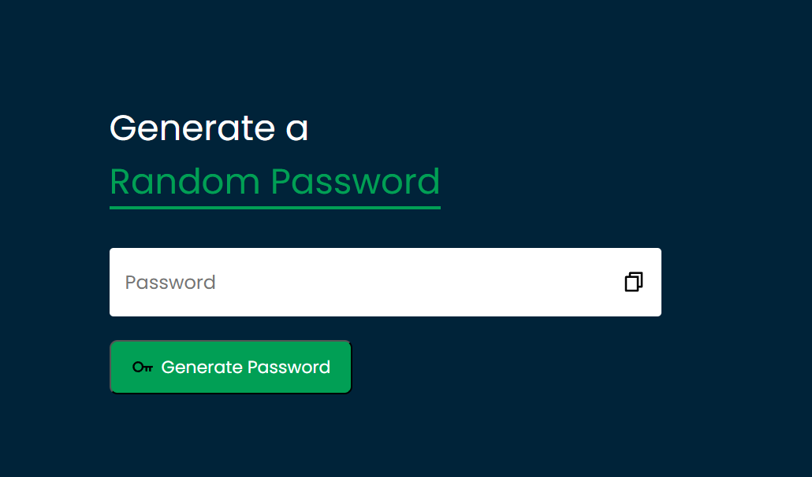

## Random Password Generator 🔑
A Password Generator App that help user to create Strong and random password each time. User can create 12 length Long password just a click of button also copy it easily using Copy API.
## Features ✨
- Random Password Generate
- Strong Password contain UpperCase LowerCase Number and Symbol.
- Easy copy in clipboard from clicking copy button.

## Demo 🚀
[Live Demo] (Replace may change latter)

## Technologies Used 🛠️

- Frontend: HTML, CSS, JavaScript
- API: Copy API
- Icons: Font Awesome
- Hosting: (e.g., Netlify, GitHub Pages)

## Setup Instructions 🔧
Prerequisites

- Basic understanding of web development.

## Usage 🖥️

1. Click the Generate Password button to create password.
2. Use the copy icon button  save it in clipboard.

## Contributing 🤝

Contributions, issues, and feature requests are welcome!
Feel free to check the issues page (replace with your repository issues link).
[Live Demo]: <https://abidsarkar.github.io/LIVE/>