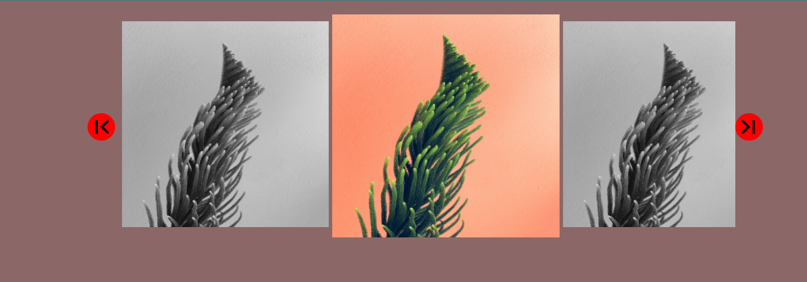

## horizontal sliding

This project demonstrates a horizontal sliding effect using JavaScript. It is a part of a series of mini learning projects aimed at enhancing JavaScript skills.

## Technologies Used

- HTML
- CSS
- JavaScript

## How to Use

1. Clone the repository:
    ```bash
    git clone https://github.com/yourusername/your-repo.git
    ```
2. Navigate to the project directory:
    ```bash
    cd /e:/code/js/javascript-mini-learning-project/project_14\ Horizontal\ sliding
    ```
3. Open `index.html` in your preferred web browser to see the horizontal sliding effect in action.

## API Usage

This project does not use any external APIs.

## Contributing

If you would like to contribute to this project, please fork the repository and submit a pull request.

## License

This project is licensed under the MIT License. See the [LICENSE](../LICENSE) file for more details.

## Contact

For any questions or feedback, please contact [your email](mailto:your.email@example.com).
