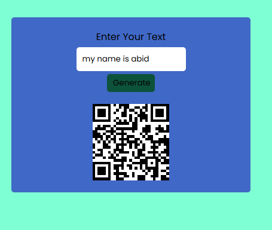

## QR Code Generator 🔑
A QR Code Generator App that help user to create QR code from typing each time.
## Features ✨
- Offline QR Code Generate

## Demo 🚀
[Live Demo] (Replace may change latter)

## Technologies Used 🛠️

- Frontend: HTML, CSS, JavaScript
- API: QRCODE API
- Icons: Font Awesome
- Hosting: (e.g., Netlify, GitHub Pages)

## Setup Instructions 🔧
Prerequisites

- Basic understanding of web development.

## Usage 🖥️

1. Type in the input fila.
2. click on the generate Button

## Contributing 🤝

Contributions, issues, and feature requests are welcome!
Feel free to check the issues page (replace with your repository issues link).
[Live Demo]: <https://abidsarkar.github.io/LIVE/>