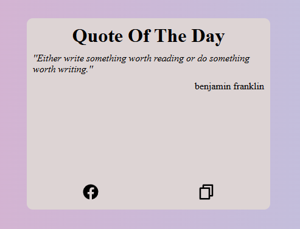

## Daily Quote Project

### Description
This project displays a daily quote to inspire and motivate users. It fetches quotes from a public API and displays them on the web page.

### Technologies Used
- HTML
- CSS
- JavaScript
- Fetch API

### How to Use
1. Clone the repository:
    ```bash
    git clone https://github.com/yourusername/your-repo-name.git
    ```
2. Navigate to the project directory:
    ```bash
    cd project_15\ Daily\ Quote
    ```
3. Open `index.html` in your web browser to view the daily quote.

### Features
- Fetches a new quote each day
- Simple and clean user interface
- Responsive design

### API
This project uses the [Quotes API](https://api.quotable.io) to fetch daily quotes.

### License
This project is licensed under the MIT License.

### Author
[Your Name](https://github.com/yourusername)