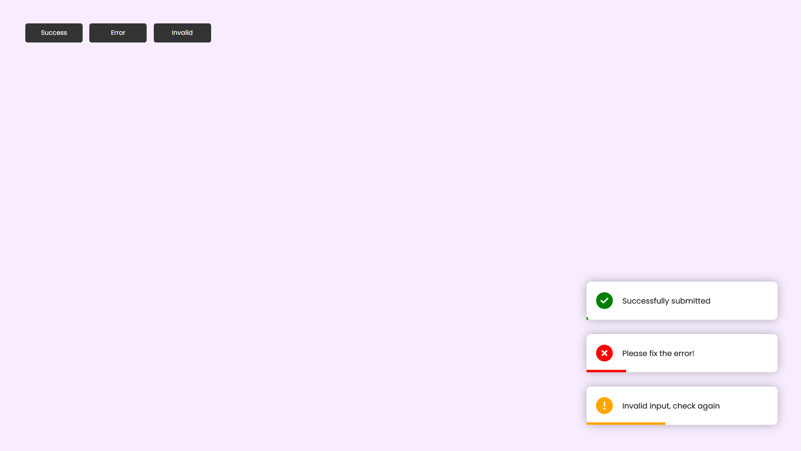

# Toast Notification Project

This project demonstrates how to create a simple toast notification using JavaScript, HTML, and CSS.

## Technologies Used

- HTML
- CSS
- JavaScript

## How to Use

1. Clone the repository:
    ```bash
    git clone https://github.com/yourusername/your-repo-name.git
    ```
2. Navigate to the project directory:
    ```bash
    cd your-repo-name/project_16 Toast notification
    ```
3. Open `index.html` in your web browser to see the toast notification in action.

## Screenshot



