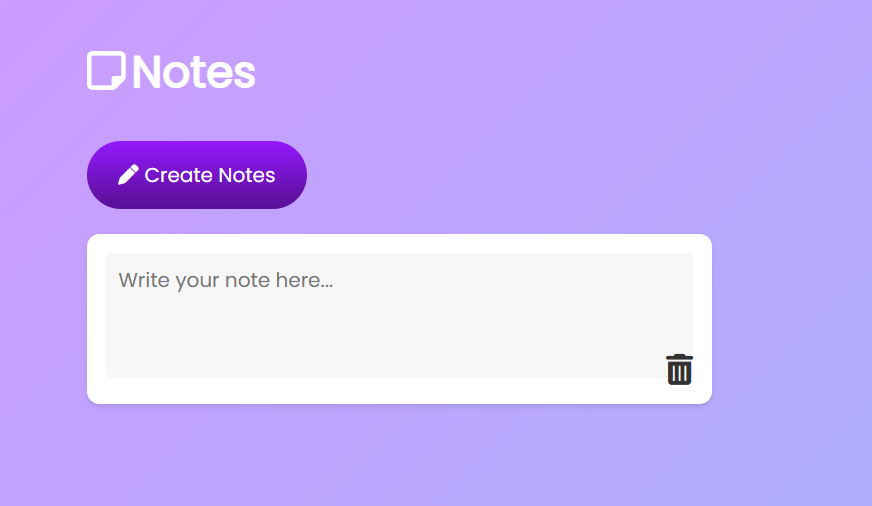

# Note App
This project contains a notes app that stores data locally.

## Features
- Create, edit, and delete notes
- Store notes in local storage
- Responsive design

## Installation
1. Clone the repository:
    ```bash
    git clone /e:/code/js/javascript-mini-learning-project/project_17 Notes App
    ```
2. Open the project directory:
    ```bash
    cd project_17 Notes App
    ```
3. Open `index.html` in your browser to start the app.

## Usage
- Add a new note by clicking the "Add Note" button.
- Edit a note by clicking on the note content.
- Delete a note by clicking the "Delete" button.

## License
This project is licensed under the MIT License.