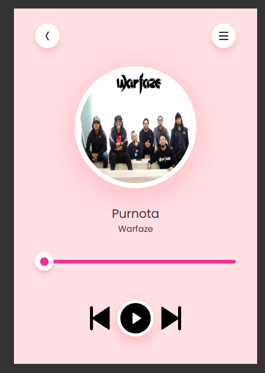

# Music Player App

## Features

- **Play/Pause Music**: Play and pause your favorite tracks with ease.
- **Next/Previous Track**: Skip to the next or previous track in your playlist.
- **Shuffle**: Shuffle your playlist for a random music experience.
- **Repeat**: Repeat the current track or the entire playlist.
- **Volume Control**: Adjust the volume to your preference.
- **Track Progress**: View the progress of the current track.
- **Playlist Management**: Add or remove tracks from your playlist.

## Getting Started

### Prerequisites

- Node.js
- npm (Node Package Manager)

### Installation

1. Clone the repository:
    ```bash
    git clone https://github.com/yourusername/music-player-app.git
    ```
2. Navigate to the project directory:
    ```bash
    cd music-player-app
    ```
3. Install the dependencies:
    ```bash
    npm install
    ```

### Usage

1. Start the application:
    ```bash
    npm start
    ```
2. Open your browser and navigate to `http://localhost:3000` to use the music player app.

## API

This project uses the following API:

- **Music API**: Fetches music tracks and metadata. (Replace with actual API details if applicable)

## Contributing

Contributions are welcome! Please fork the repository and create a pull request with your changes.

## License

This project is licensed under the MIT License. See the [LICENSE](LICENSE) file for details.

## Acknowledgements

- Thanks to the open-source community for their valuable contributions.
- Special thanks to the creators of the music API used in this project.
