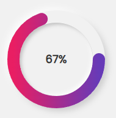

## Project 23: Progress Bar

### Features
- Dynamic progress bar that updates in real-time.
- Customizable appearance and behavior.
- Lightweight and easy to integrate into any project.
- Responsive design that works on all devices.

### Installation
1. Clone the repository:
    ```bash
    git clone https://github.com/yourusername/javascript-mini-learning-project.git
    ```
2. Navigate to the project directory:
    ```bash
    cd javascript-mini-learning-project/project_23\ progress\ Bar
    ```
3. Open `index.html` in your browser to see the progress bar in action.

### Usage
Include the following script in your HTML file:
```html
<script src="progress-bar.js"></script>
```
Initialize the progress bar in your JavaScript code:
```javascript
const progressBar = new ProgressBar({
    container: '#progress-bar-container',
    initialValue: 0
});
```

### API
If your project uses an API, mention it here. For example:
- Fetch progress data from an API endpoint:
    ```javascript
    fetch('https://api.example.com/progress')
        .then(response => response.json())
        .then(data => progressBar.update(data.value));
    ```

### License
This project is licensed under the MIT License.

### Contributing
Feel free to submit issues and pull requests. Contributions are welcome!

### Contact
For any questions or feedback, please contact [your email](mailto:your.email@example.com).