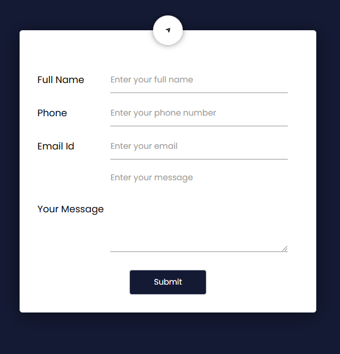

## Project 25: Form Validation

This project demonstrates a simple form validation using JavaScript. The form includes fields for name, email, and password, and provides real-time feedback to the user.

### Features

- Real-time validation for form fields
- Custom error messages
- Responsive design

### Installation

1. Clone the repository:
    ```bash
    git clone https://github.com/yourusername/project_25_form_validation.git
    ```
2. Navigate to the project directory:
    ```bash
    cd project_25_form_validation
    ```
3. Open `index.html` in your browser to view the form.

### Usage

- Fill out the form fields and see the validation messages in real-time.
- Ensure all fields are correctly filled before submitting the form.

### Contributing

Contributions are welcome! Please fork the repository and create a pull request with your changes.

### License

This project is licensed under the MIT License. See the [LICENSE](LICENSE) file for details.

### Contact

For any questions or feedback, please contact [yourname@example.com](mailto:yourname@example.com).