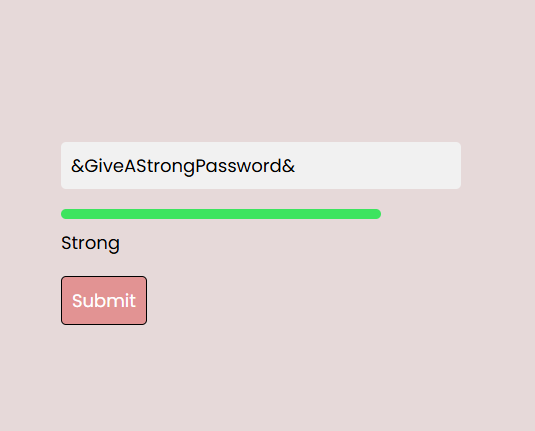

## Password Strength Check

This project is a simple password strength checker implemented in JavaScript. It evaluates the strength of a password based on various criteria such as length, use of uppercase and lowercase letters, numbers, and special characters.

### Features

- Real-time password strength evaluation
- Visual feedback on password strength
- Suggestions for improving password strength

### Usage

1. Clone the repository:
    ```bash
    git clone https://github.com/yourusername/password-strength-check.git
    ```
2. Open the `index.html` file in your web browser to use the password strength checker.

### License

This project is licensed under the MIT License. See the [LICENSE](LICENSE) file for details.

### Contributing

Contributions are welcome! Please open an issue or submit a pull request for any changes.

### Contact

For any questions or feedback, please contact [yourname@example.com](mailto:yourname@example.com).