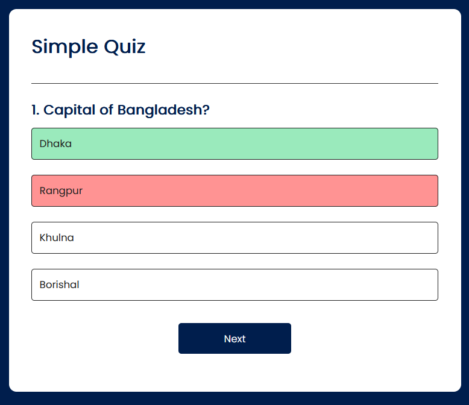

# Quiz App

This is a simple Quiz App built with JavaScript. The app allows users to take a quiz and get their scores at the end.

## Technologies Used

- HTML
- CSS
- JavaScript

## Features

- Multiple choice questions
- Score calculation
- Responsive design

## How to Use

1. Clone the repository:
    ```bash
    git clone https://github.com/yourusername/your-repo-name.git
    ```
2. Navigate to the project directory:
    ```bash
    cd your-repo-name/project_4\ quiz\ app
    ```
3. Open `index.html` in your web browser to start the quiz.

## Project Structure

```
project_4 quiz app/
│
├── index.html
├── styles.css
└── script.js
```

## Contributing

Feel free to fork this project and submit pull requests. Any contributions are welcome!

## License

This project is licensed under the MIT License.