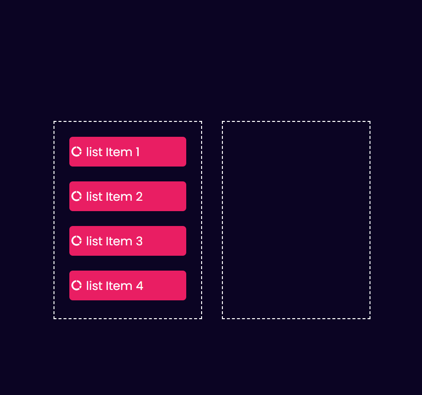
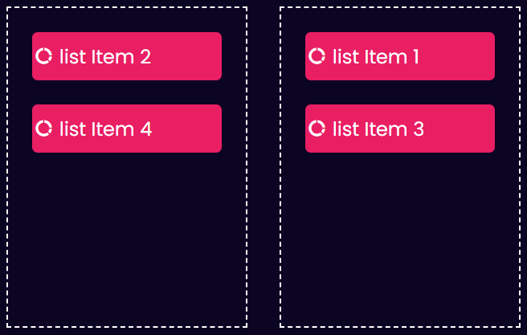
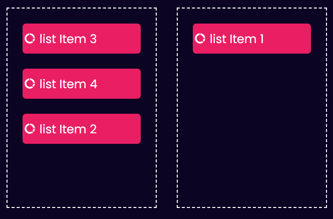

# Drag-and-Drop Project

This project implements a simple drag-and-drop functionality using HTML, CSS, and JavaScript. Users can drag list items from one container to another.

## Features

- Drag-and-drop functionality for list items
- Uses Remixicon icons for visual appeal
- Clean and responsive layout

## Technologies Used

- HTML: Structure and content of the web page
- CSS: Styling and layout
- JavaScript: Drag-and-drop functionality

## Setup Instructions

1. Clone this repository to your local machine.
2. Open the `index.html` file in your web browser.

## Usage

1. Drag any list item from the left container to the right container.
2. The dragged item will be appended to the right container.
3. You can drag items back to the left container as well.

## Contributing

We welcome contributions to this project! Please feel free to submit pull requests with improvements or additional features.

## License

This project is licensed under the MIT License. For more information, see the `LICENSE` file.

## Additional Notes

- You can customize the styles in the `style.css` file to match your preferences.
- You can add more list items or features to enhance the functionality of this project.