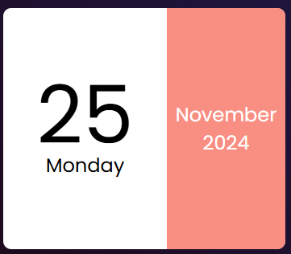

# Calendar Widget | ABID

A simple and customizable calendar widget for your web page.

## Table of Contents
- [Demo](#demo)
- [Features](#features)
- [Installation](#installation)
- [Usage](#usage)
- [Technologies Used](#technologies-used)
- [Contributing](#contributing)
- [License](#license)

## Demo
You can check out the live version of this project [here](#NoT Available right now). (Link the live demo if available)

## Features
- Displays the current date, day of the week, month, and year.
- Uses a clean and minimal design with a dark background and white calendar section.
- Responsive layout adjusts to different screen sizes.
- Easy to customize with CSS for styling preferences.

## Installation

## Usage

   Download the files:
Clone or download the repository to your local machine.

Include the files in your HTML:
Copy the index.html, style.css, and script.js files to your web project directory.

In your main HTML file (e.g., index.html), add the following lines to the <head> section to link the CSS and script files:
Customization:
Open the style.css file to modify the styling of the calendar widget to match your project's theme or preferences.
## Technologies Used
    HTML: Creates the basic structure of the calendar widget.
    CSS: Styles the appearance of the calendar widget (colors, fonts, layout).
    JavaScript: Retrieves the current date information and dynamically updates the HTML content.
## Code Overview

    index.html: Contains the HTML structure for the Text-to-Voice converter.
    textToVoice.css: CSS for styling the page.
    textToVoice.js: JavaScript logic to initialize the speech synthesis and handle the voice selection.
## Contributing
We welcome contributions to improve this project! Feel free to fork the repository and submit pull requests with your enhancements.
## License

This template includes sections for the purpose, setup, usage, and relevant technologies in the project. Customize as needed, especially with the demo link if you plan to deploy it online.
